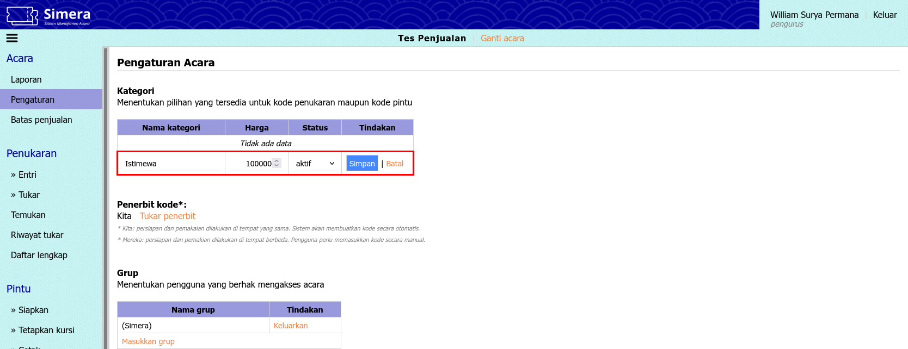
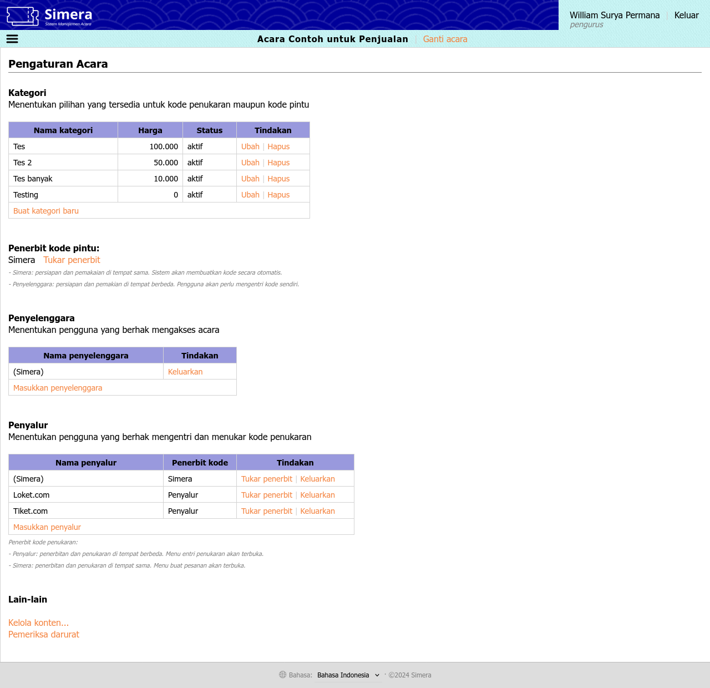

<title>Pengelola | Cara Simera</title>

[Beranda](..) &raquo; [Panduan pengguna](.) &raquo; 
# Pengelola

<table>
<tr><th>Daftar isi</th></tr>
<tr><td>

- [Membuat acara agar muncul pada situs penjualan](#membuat-acara-agar-muncul-pada-situs-penjualan)
- [Menu Acara](#menu-acara)
  - [Laporan](#laporan)
  - [Pengaturan](#pengaturan)
  - [Batas penjualan](#batas-penjualan)
  - [Hapus data](#hapus-data)
- [Menu Penukaran](#menu-penukaran)
  - [Entri](#entri)
  - [Tukar](#tukar)
  - [Temukan](#temukan)
- [Menu Pintu](#menu-pintu)
  - [Siapkan](#siapkan)
  - [Tetapkan kursi](#tetapkan-kursi)
  - [Cetak](#cetak)
  - [Jual](#jual)
  - [Pakai masuk](#pakai-masuk)
  - [Pakai keluar](#pakai-keluar)
  - [Periksa](#periksa)
- [Menu Pesanan](#menu-pesanan)
  - [Buat](#buat)

</td></tr>
</table>

## Membuat acara agar muncul pada situs penjualan
**Panduan langkah demi langkah:**
1. Kunjungi situs sistem [maha.simera.web.id](maha.simera.web.id)
1. Masuk ke sistem dengan akun pengurus atau pengelola
1. Pilih sembarang acara
1. Buka menu **Kelola > Acara**
1. Buat acara baru seperti biasa
   
   
1. Klik "Ganti acara"
1. Pilih acara yang baru saja dibuat
1. Buka menu **Acara > Pengaturan**
1. Buat kategori baru seperti biasa, dan pastikan harga diisi
   
   
1. Masukkan "(Simera)" sebagai mitra, dan atur "Kita" sebagai penerbit kode
   
   
1. Klik "Kelola konten..." pada bagian bawah
1. Untuk masing-masing bahasa, tentukan:
   - Warna latar (dipakai pada halaman rincian acara situs penjualan)
   - Gambar (dipakai pada halaman daftar acara dan rincian acara situs penjualan)
   - Logo (dipakai pada bukti pemesan pelanggan)
   - Penjelasan acara (dipakai pada halaman rincian acara situs penjualan dan bukti pemesan pelanggan)
   - Syarat dan ketentuan (dipakai pada halaman rincian acara situs penjualan dan bukti pemesan pelanggan)
   - Pemberitahuan pesanan selesai (dipakai pada email pelanggan saat kode diterbitkan)
   
   
1. Buka menu **Acara > Batas penjualan**
1. Untuk setiap kategori yang ingin dibuka pada situs penjualan, ubah:
   - Statusnya dari "tersembunyi" menjadi "aktif"
   - Waktu dimulai dan berakhirnya penjualan
   - Kuota alokasi, sesuai dengan berapa banyak yang dapat dibeli
   
   
1. Setelah selesai, klik "Aktifkan" pada status batas penjualan untuk "(Simera)"
    
   
1. Kunjungi situs penjualan [www.simera.web.id](www.simera.web.id), dan pastikan acara sudah muncul
    
   

&middot;

**Informasi tambahan:**
Pengaruh kuota, waktu, dan status pada situs penjualan: 
- Jika status adalah tersembunyi, maka kategori tidak akan ditampilkan 
- Jika waktu dimulai setelah waktu saat ini, maka akan muncul "segera hadir" 
- Jika waktu berakhir sebelum waktu saat ini, maka akan muncul "telah berakhir" 
- Jika status adalah nonaktif, maka akan muncul "sedang ditutup" 
- Jika kuota alokasi sama dengan kuota terpakai, maka akan muncul "habis terjual" 
- Jika waktu saat ini setelah waktu dimulai dan sebelum waktu berakhir, maka penjualan dibuka 
- Jika semua kondisi di atas tidak ada yang terpenuhi, maka akan muncul "sedang ditutup" 

## Menu Acara
### Laporan
Lihat [panduan pengguna penyelenggara, bagian Laporan](penyelenggara#laporan)

### Pengaturan
**Tautan:** [https://maha.simera.web.id/pengaturan](https://maha.simera.web.id/pengaturan)

**Penjelasan:** Menu ini digunakan untuk mengatur setelan acara, termasuk:
- kategori apa saja yang tersedia;
- siapa saja penyelenggara dan penyalur yang terlibat dalam acara ini; serta
- siapa yang akan menerbitkan kode penukaran di masing-masing penyalur dan kode pintu secara keseluruhan.

### Batas penjualan
**Tautan:** [https://maha.simera.web.id/batasan](https://maha.simera.web.id/batasan)

**Penjelasan:** Menu ini digunakan untuk menerapkan batas penjualan pada situs penjualan [www.simera.web.id](www.simera.web.id), termasuk:
- kategori apa saja yang dapat dijual;
- berapa banyak alokasi kuota per kategorinya; serta
- kapan waktu penjualan dimulai dan berakhir.

**Panduan langkah demi langkah:** Lihat [Membuat acara agar muncul pada situs penjualan](#membuat-acara-agar-muncul-pada-situs-penjualan).

### Hapus data
**Tautan:** [https://maha.simera.web.id/hapus](https://maha.simera.web.id/hapus)

**Penjelasan:** Menu ini digunakan untuk menghapus (membatalkan penerbitan) satu atau lebih kode penukaran yang sudah dientri, maupun kode pintu yang sudah disiapkan.

## Menu Penukaran
### Entri
Lihat [panduan pengguna penyalur, bagian Entri](penyalur#entri)

### Tukar
Lihat [panduan pengguna petugas penukaran, bagian Tukar](petugas_penukaran#tukar)

### Temukan
Lihat [panduan pengguna petugas penukaran, bagian Temukan](petugas_penukaran#temukan)

## Menu Pintu
### Siapkan
**Tautan:** [https://maha.simera.web.id/siapkan](https://maha.simera.web.id/siapkan)

**Penjelasan:** Menu ini digunakan untuk
- membuatkan kode pintu secara otomatis oleh sistem jika "Penerbit kode pintu" pada menu **Acara > Pengaturan** disetel ke "Simera"; atau
- mengentri kode pintu sendiri oleh pengguna jika "Penerbit kode pintu" pada menu **Acara > Pengaturan** disetel ke "Penyelenggara".

### Tetapkan kursi
**Tautan:** [https://maha.simera.web.id/tetapkan_kursi](https://maha.simera.web.id/tetapkan_kursi)

**Penjelasan:** Menu ini digunakan untuk menetapkan kursi pada kode pintu.

### Cetak
**Tautan:** [https://maha.simera.web.id/cetak](https://maha.simera.web.id/cetak)

**Penjelasan:** Menu ini digunakan untuk mencetak kode pintu pada label, termasuk mengatur tata letaknya dan jenis kode yang digunakan (barcode atau QR code).

### Jual
Lihat [panduan pengguna petugas penukaran, bagian Jual](petugas_penukaran#jual)

### Pakai masuk
Lihat [panduan pengguna petugas pintu, bagian Pakai masuk](petugas_pintu#pakai-masuk)

### Pakai keluar
Lihat [panduan pengguna petugas pintu, bagian Pakai keluar](petugas_pintu#pakai-keluar)

### Periksa
Lihat [panduan pengguna petugas pintu, bagian Periksa](petugas_pintu#periksa)

## Menu Pesanan
### Buat
Lihat [panduan pengguna penyalur, bagian Buat](penyalur#buat)
