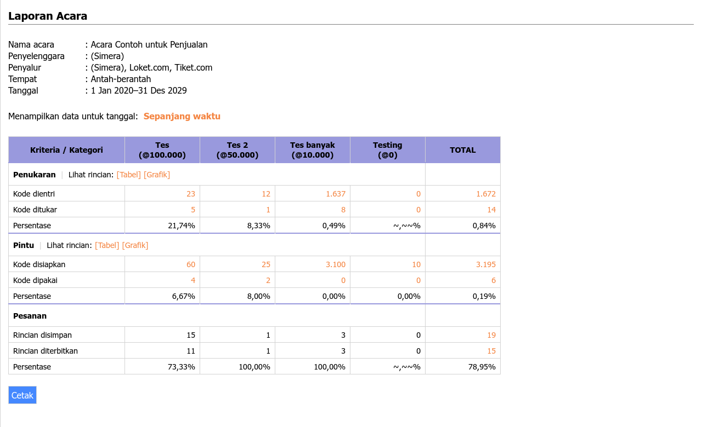
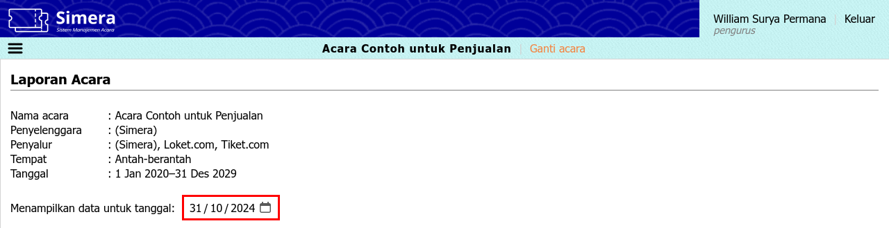
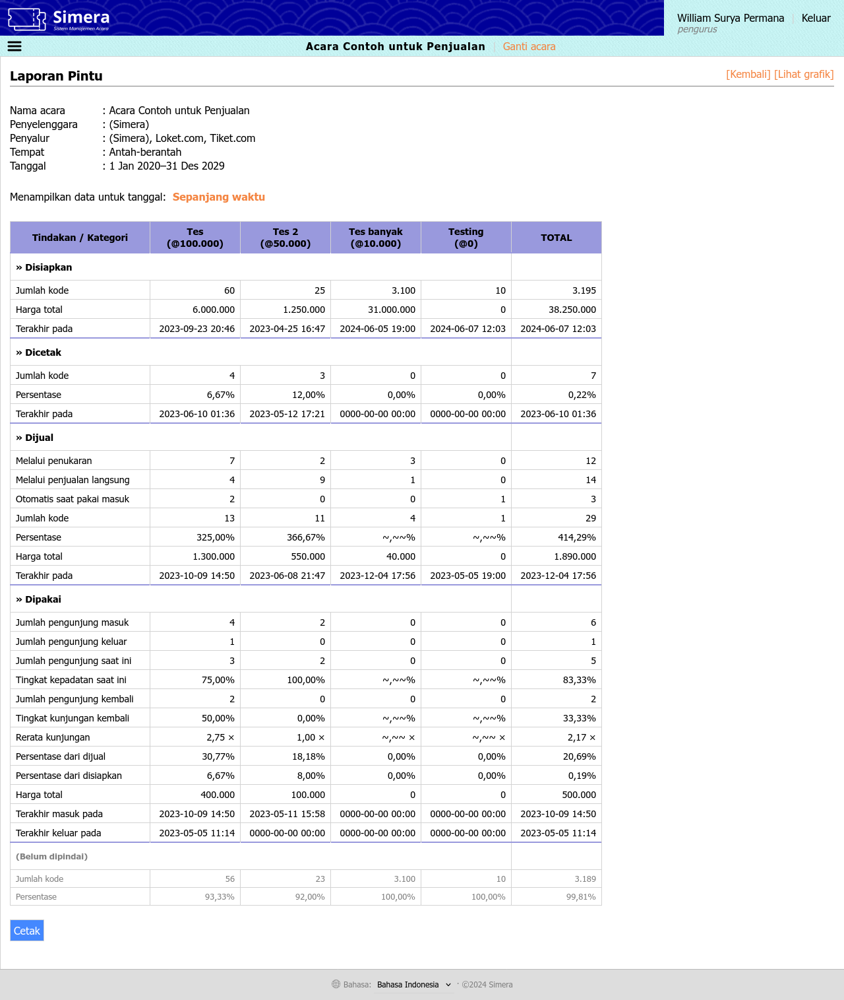
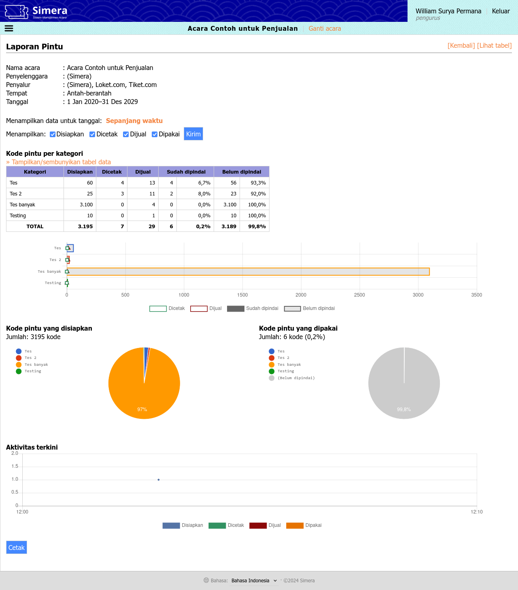

<title>Penyelenggara | Cara Simera</title>

[Beranda](..) &raquo; [Panduan pengguna](.) &raquo; 
# Penyelenggara

> **Daftar isi**
> 
> - [Masuk ke sistem](#masuk-ke-sistem)
> - [Menu Acara](#menu-acara)
>   - [Laporan](#laporan)
> - [Menu Penukaran](#menu-penukaran)
>   - [Tukar](#tukar)
>   - [Temukan](#temukan)
> - [Menu Pintu](#menu-pintu)
>   - [Jual](#jual)
>   - [Pakai masuk](#pakai-masuk)
>   - [Pakai keluar](#pakai-keluar)
>   - [Periksa](#periksa)

## Masuk ke sistem
**Panduan langkah demi langkah:**
1. Kunjungi situs sistem [maha.simera.web.id](//maha.simera.web.id)
1. Jika Anda adalah petugas koordinasi, masukkan ID pengguna "COORCREWXXXX", di mana XXXX adalah nomor urut
1. Jika Anda adalah mitra Simera, masukkan ID pengguna yang sudah diberitahukan sebelumnya
1. Masukkan 6 digit PIN yang sudah diberitahukan sebelumnya
1. Klik tombol "Masuk"
1. Klik salah satu acara yang diinginkan
1. Pada tampilan seluler, klik ikon hamburger di sebelah kiri atas untuk mengakses menu

## Menu Acara
### Laporan
**Tautan:** [https://maha.simera.web.id/laporan](https://maha.simera.web.id/laporan)

**Penjelasan:** Menu ini digunakan untuk melihat keseluruhan laporan acara, baik dari kode penukaran, kode pintu, maupun pesanan.

**Panduan langkah demi langkah:**
1. Di halaman awal, sistem akan menampilkan:
   - Untuk kode penukaran, jumlah kode ditukar dari seluruh kode dientri beserta persentasenya 
   - Untuk kode pintu, jumlah kode dipakai dari seluruh kode disiapkan beserta persentasenya
   - Untuk pesanan, jumlah rincian diterbitkan dari seluruh rincian disimpan beserta persentasenya
   
   
1. Untuk melihat data dari tanggal tertentu saja, klik pada teks "Sepanjang waktu" di samping label "Menampilkan data untuk tanggal:" pada bagian atas tabel, lalu ubah sesuai tanggal yang diinginkan

1. Untuk melihat lebih rinci laporan dalam bentuk tabel atau grafik, klik pada teks "[Tabel]" atau "[Grafik]" di samping label "Lihat rincian:" pada masing-masing baris kode penukaran dan kode pintu
_Contoh laporan rinci dalam bentuk tabel:_

_Contoh laporan rinci dalam bentuk grafik:_

   1. Untuk kembali ke laporan awal, klik [Kembali] di kanan atas 
   1. Untuk beralih tampilan, klik [Lihat tabel] atau [Lihat grafik] di kanan atas 
   1. Untuk melihat data dari tanggal tertentu saja, klik pada teks "Sepanjang waktu" di samping label "Menampilkan data untuk tanggal:" pada bagian atas tabel, lalu ubah sesuai tanggal yang diinginkan
1. Untuk melihat daftar lengkap masing-masing kode penukaran dan kode pintu, klik pada angka yang ada pada tabel

## Menu Penukaran
### Tukar
Lihat [panduan pengguna petugas penukaran, bagian Tukar](petugas_penukaran#tukar)

### Temukan
Lihat [panduan pengguna petugas penukaran, bagian Temukan](petugas_penukaran#temukan)

## Menu Pintu
### Jual
Lihat [panduan pengguna petugas penukaran, bagian Jual](petugas_penukaran#jual)

### Pakai masuk
Lihat [panduan pengguna petugas pintu, bagian Pakai masuk](petugas_pintu#pakai-masuk)

### Pakai keluar
Lihat [panduan pengguna petugas pintu, bagian Pakai keluar](petugas_pintu#pakai-keluar)

### Periksa
Lihat [panduan pengguna petugas pintu, bagian Periksa](petugas_pintu#periksa)

---

_Akhir dari dokumen_ &#x7C; [Kembali ke atas](#)
