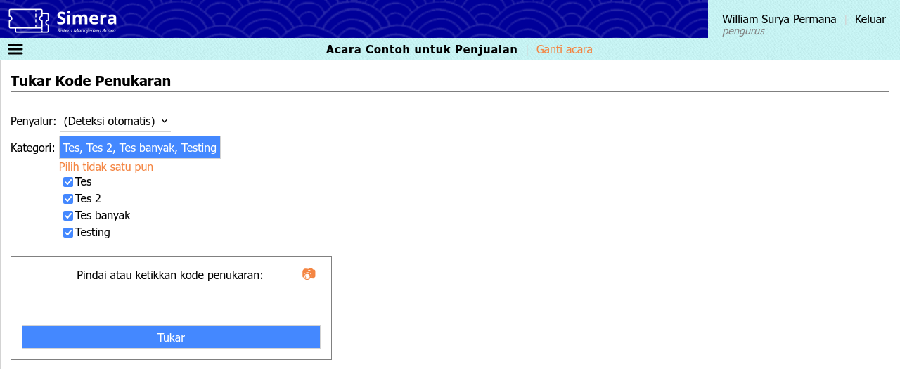
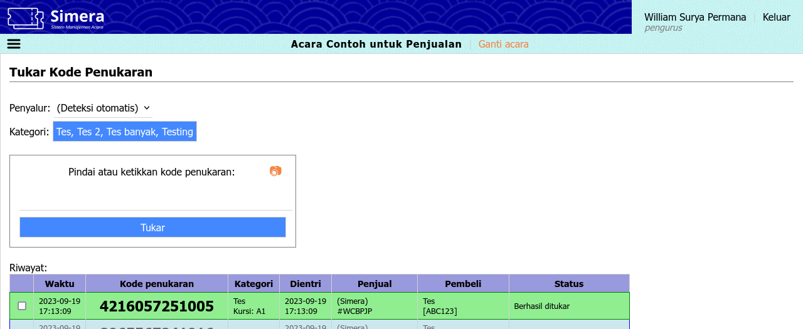
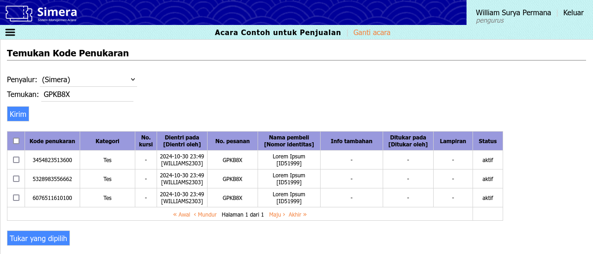
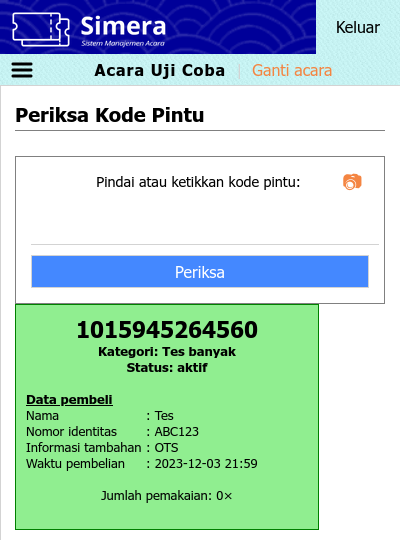

[Beranda](../index) &raquo; [Panduan pengguna](index) &raquo; 
# Petugas penukaran

## Masuk ke sistem
1. Kunjungi situs sistem maha.simera.web.id
1. Masukkan ID pengguna "TBOXCREWXXXX", di mana XXXX adalah nomor urut
1. Masukkan 6 digit PIN yang sudah diberitahukan sebelumnya
1. Klik tombol "Masuk"
1. Klik salah satu acara yang diinginkan
1. Pada tampilan seluler, klik ikon hamburger di sebelah kiri atas untuk mengakses menu

## Menu Penukaran
### Tukar
Tautan: https://maha.simera.web.id/tukar
Menu ini digunakan untuk menukar kode penukaran yang belum ditukar, dan menghubungkannya dengan kode pintu jika diperlukan. Dengan menghubungkan, informasi pembeli dari kode penukaran akan diteruskan ke kode pintu. Hanya 25 data terakhir yang dapat ditampilkan.

1. Klik daftar tarik-turun di samping label "Penyalur:"
1. Pilih kode penukaran dari penyalur mana yang ingin ditukar, atau biarkan jika ingin sistem mendeteksi otomatis penyalur berdasarkan kode penukaran
   * Penukaran berisiko gagal saat menggunakan deteksi otomatis jika terdapat kode penukaran yang sama di dua atau lebih penyalur
1. Klik tombol di samping label "Kategori:"
1. Lepas centang pada kategori-kategori yang tidak ingin ditukar
   
1. Jika menggunakan alat pemindai:
   1. Aktifkan kursor dengen mengeklik kotak teks
   1. Tekan dan tahan tombol pindai pada alat
   1. Arahkan pemindai ke kode, lalu lepaskan tombol pindai
1. Jika menggunakan papan ketik:
   1. Aktifkan kursor dengen mengeklik kotak teks
   1. Ketikkan kode penukaran secara manual
   1. Tekan Enter, atau klik tombol "Periksa"
1. Jika menggunakan kamera:
   1. Aktifkan kamera dengen mengeklik ikon &#x1F4F7;&#xFE0E;
   1. Arahkan kamera ke kode hingga terdengar [bunyi seperti ini](https://maha.simera.web.id/aset/suara/Cursor1.ogg)
1. Hasil akan ditampilkan di paling atas dalam tabel riwayat
   1. Jika hijau dan terdengar [bunyi seperti ini](https://maha.simera.web.id/aset/suara/Chime1.ogg), berarti kode penukaran berhasil ditukar
   1. Jika merah dan terdengar [bunyi seperti ini](https://maha.simera.web.id/aset/suara/Buzzer1.ogg), berarti kode penukaran gagal ditukar
   1. Jika biru, berarti kode penukaran sudah ditambahkan lampirannya atau dihubungkan ke kode pintu
   1. Jika putih, berarti kode penukaran sedang diproses. Jika tidak berubah sekian lama, pastikan Internet stabil, lalu klik pada baris tersebut untuk mencoba kembali.
   
1. Untuk menambahkan lampiran untuk penukaran ini, centang pada kode-kode yang ingin dihubungkan, lalu di samping label "Dengan yang dipilih", klik tombol "Tambah lampiran"
1. Untuk melanjutkan ke penghubungan dengan kode pintu, centang pada kode-kode yang ingin dihubungkan, lalu di samping label "Dengan yang dipilih", klik tombol "Hubungkan ke kode pintu".

### Temukan
Tautan: https://maha.simera.web.id/temukan
Menu ini digunakan untuk menemukan kode penukaran berdasarkan nomor kursi, nama, atau nomor pesanan. Menu ini juga bisa digunakan untuk memeriksa kode penukaran, apakah terdaftar atau tidak.

1. Klik daftar tarik-turun di samping label "Penyalur:"
1. Pilih kode penukaran dari penyalur mana yang ingin ditemukan
1. Aktifkan kursor dengen mengeklik kotak teks
1. Jika menggunakan alat pemindai:
   1. Tekan dan tahan tombol pindai pada alat
   1. Arahkan pemindai ke kode, lalu lepaskan tombol pindai
1. Jika menggunakan papan ketik:
   1. Ketikkan kode pintu, nomor kursi, nama, atau nomor pesanan secara manual
   1. Tekan Enter, atau klik tombol "Kirim"
1. Hasil temuan akan ditampilkan pada tabel di bawah
   
1. Untuk melanjutkan ke penukaran, centang pada kode-kode yang ingin ditukar, lalu klik tombol "Tukar yang dipilih"

## Menu Pintu
### Jual
Tautan: https://maha.simera.web.id/jual
Menu ini digunakan untuk menjual kode pintu secara langsung tanpa melalui proses tukar kode penukaran. Informasi pembeli akan langsung disimpan pada kode pintu. Untuk mencetak tiket fisik, masuk ke sistem dengan akun pengurus atau pengelola, lalu gunakan menu **Pintu > Cetak**.

### Periksa
Tautan: https://maha.simera.web.id/periksa
Menu ini digunakan untuk memeriksa kode pintu, apakah terdaftar, dan apakah sudah dipakai. Hanya 1 data yang ditampilkan.

1. Jika menggunakan alat pemindai:
   1. Aktifkan kursor dengen mengeklik kotak teks
   1. Tekan dan tahan tombol pindai pada alat
   1. Arahkan pemindai ke kode, lalu lepaskan tombol pindai
1. Jika menggunakan papan ketik:
   1. Aktifkan kursor dengen mengeklik kotak teks
   1. Ketikkan kode pintu secara manual
   1. Tekan Enter, atau klik tombol "Periksa"
1. Jika menggunakan kamera:
   1. Aktifkan kamera dengen mengeklik ikon &#x1F4F7;&#xFE0E;
   1. Arahkan kamera ke kode hingga terdengar bunyi [bunyi seperti ini](https://maha.simera.web.id/aset/suara/Cursor1.ogg)
1. Hasil akan ditampilkan di bawah
   1. Jika hijau, berarti kode pintu ditemukan
   1. Jika merah, berarti kode pintu tidak ditemukan
   
