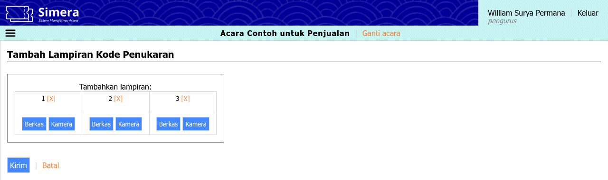
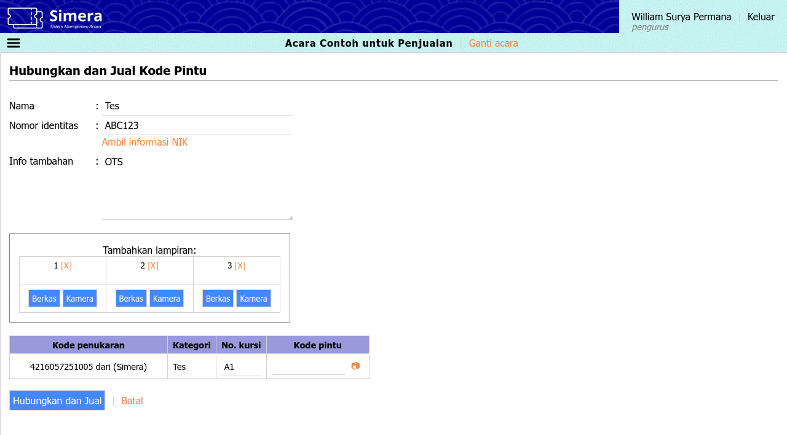

<title>Petugas penukaran | Cara Simera</title>

[Beranda](..) &raquo; [Panduan pengguna](.) &raquo; 
# Petugas penukaran

> **Daftar isi**
> 
> - [Masuk ke sistem](#masuk-ke-sistem)
> - [Menu Penukaran](#menu-penukaran)
>   - [Tukar](#tukar)
>     - [Tambah lampiran](#tambah-lampiran)
>     - [Hubungkan dan jual](#hubungkan-dan-jual)
>   - [Temukan](#temukan)
> - [Menu Pintu](#menu-pintu)
>   - [Jual](#jual)
>   - [Periksa](#periksa)

## Masuk ke sistem
**Panduan langkah demi langkah:**
1. Kunjungi situs sistem [maha.simera.web.id](//maha.simera.web.id)
1. Masukkan ID pengguna "TBOXCREWXXXX", di mana XXXX adalah nomor urut
1. Masukkan 6 digit PIN yang sudah diberitahukan sebelumnya
1. Klik tombol "Masuk"
1. Klik salah satu acara yang diinginkan
1. Pada tampilan seluler, klik ikon hamburger di sebelah kiri atas untuk mengakses menu

## Menu Penukaran
### Tukar
**Tautan:** [https://maha.simera.web.id/tukar](https://maha.simera.web.id/tukar)

**Penjelasan:** Menu ini digunakan untuk menukar kode penukaran yang belum ditukar, lalu menambahkan lampirannya atau menghubungkannya dengan kode pintu jika diperlukan.  Hanya 25 data terakhir yang dapat ditampilkan.

**Panduan langkah demi langkah:**
1. Klik daftar tarik-turun di samping label "Penyalur:"
1. Pilih kode penukaran dari penyalur mana yang ingin ditukar, atau biarkan jika ingin sistem mendeteksi otomatis penyalur berdasarkan kode penukaran
   * Penukaran berisiko gagal saat menggunakan deteksi otomatis jika terdapat kode penukaran yang sama di dua atau lebih penyalur
1. Klik tombol di samping label "Kategori:"
1. Lepas centang pada kategori-kategori yang tidak ingin ditukar
   
   
1. Jika menggunakan alat pemindai:
   1. Aktifkan kursor dengen mengeklik kotak teks
   1. Tekan dan tahan tombol pindai pada alat
   1. Arahkan pemindai ke kode, lalu lepaskan tombol pindai
1. Jika menggunakan papan ketik:
   1. Aktifkan kursor dengen mengeklik kotak teks
   1. Ketikkan kode penukaran secara manual
   1. Tekan Enter, atau klik tombol "Periksa"
1. Jika menggunakan kamera:
   1. Aktifkan kamera dengen mengeklik ikon &#x1F4F7;&#xFE0E;
   1. Arahkan kamera ke kode hingga terdengar [bunyi seperti ini](https://maha.simera.web.id/aset/suara/Cursor1.ogg)
1. Hasil akan ditampilkan di paling atas dalam tabel riwayat
   1. Jika **hijau** dan terdengar [bunyi seperti ini](https://maha.simera.web.id/aset/suara/Chime1.ogg), berarti kode penukaran berhasil ditukar
   1. Jika **merah** dan terdengar [bunyi seperti ini](https://maha.simera.web.id/aset/suara/Buzzer1.ogg), berarti kode penukaran gagal ditukar
   1. Jika **biru**, berarti kode penukaran sudah ditambahkan lampirannya atau dihubungkan ke kode pintu
   1. Jika **putih**, berarti kode penukaran sedang diproses. Jika tidak berubah sekian lama, pastikan Internet stabil, lalu klik pada baris tersebut untuk mencoba kembali.
   
   
1. Penukaran dapat dilanjutkan dengan mencentang pada kode-kode yang ingin diproses, lalu di samping label "Dengan yang dipilih", tekan tombol "Tambah lampiran" atau "Hubungkan ke kode pintu" sesuai yang diinginkan (opsional)

#### Tambah lampiran
**Tautan:** [https://maha.simera.web.id/lampirkan](https://maha.simera.web.id/lampirkan)

**Penjelasan:** Sub-menu ini digunakan untuk menambahkan lampiran pada kode penukaran. Untuk melihat kembali lampiran yang diunggah, gunakan menu **Penukaran > Temukan**.

**Panduan langkah demi langkah:**
1. Tambahkan lampiran dengan mengeklik salah satu tombol (wajib)
   1. "Berkas", jika ingin mengunggah berkas yang sudah disiapkan
   1. "Kamera", jika ingin mengunggah gambar yang akan diambil menggunakan kamera
1. Ulangi proses jika diperlukan, maksimum 3 lampiran
1. Untuk menghapus salah satu lampiran yang sudah dipilih, klik pada [X]
1. Klik tombol "Kirim"
1. Pengguna akan diarahkan kembali ke menu Tukar jika proses berhasil. Jika tidak, baca pesan kesalahan yang muncul.

#### Hubungkan dan jual
**Tautan:** [https://maha.simera.web.id/hubungkan](https://maha.simera.web.id/hubungkan)

**Penjelasan:** Sub-menu ini digunakan untuk menghubungkan kode penukaran dengan kode pintu. Dengan menghubungkan, informasi pembeli dari kode penukaran akan diteruskan ke kode pintu.

**Panduan langkah demi langkah:**
1. Periksa kembali nama, nomor identitas, dan info tambahan yang tersedia. Ubah jika diperlukan, misal saat penerima kode pintu (penukar) berbeda dengan pembeli kode penukaran.
1. Tambahkan lampiran dengan mengeklik salah satu tombol (opsional)
   1. "Berkas", jika ingin mengunggah berkas yang sudah disiapkan
   1. "Kamera", jika ingin mengunggah gambar yang akan diambil menggunakan kamera
1. Ulangi proses jika diperlukan, maksimum 3 lampiran
1. Untuk menghapus salah satu lampiran yang sudah dipilih, klik pada [X]
1. Pada tabel kode penukaran, jika menggunakan alat pemindai:
   1. Aktifkan kursor dengen mengeklik kotak teks
   1. Tekan dan tahan tombol pindai pada alat
   1. Arahkan pemindai ke kode, lalu lepaskan tombol pindai
1. Pada tabel kode penukaran, jika menggunakan papan ketik:
   1. Aktifkan kursor dengen mengeklik kotak teks
   1. Ketikkan kode pintu secara manual
   1. Tekan Enter
      **Catatan:** Jika masih ada kotak teks yang berlum terisi, menekan Enter akan memindahkan kursor ke isian selanjutnya. Jika tidak ada, maka keseluruhan formulir akan terkirim.
1. Pada tabel kode penukaran, jika menggunakan kamera:
   1. Aktifkan kamera dengen mengeklik ikon &#x1F4F7;&#xFE0E;
   1. Arahkan kamera ke kode hingga terdengar [bunyi seperti ini](https://maha.simera.web.id/aset/suara/Cursor1.ogg)
1. Ulangi proses untuk semua kode penukaran
1. Klik tombol "Hubungkan dan Jual"
1. Pengguna akan diarahkan kembali ke menu Tukar jika proses berhasil. Jika tidak, baca pesan kesalahan yang muncul.

### Temukan
**Tautan:** [https://maha.simera.web.id/temukan](https://maha.simera.web.id/temukan)

**Penjelasan:** Menu ini digunakan untuk menemukan kode penukaran berdasarkan nomor kursi, nama, atau nomor pesanan; maupun memeriksa kode penukaran apakah terdaftar. Lampiran yang diunggah dari menu **Penukaran > Tukar > Tambah lampiran** juga dapat dilihat di halaman ini.

**Panduan langkah demi langkah:**
1. Klik daftar tarik-turun di samping label "Penyalur:"
1. Pilih kode penukaran dari penyalur mana yang ingin ditemukan
1. Aktifkan kursor dengen mengeklik kotak teks
1. Jika menggunakan alat pemindai:
   1. Tekan dan tahan tombol pindai pada alat
   1. Arahkan pemindai ke kode, lalu lepaskan tombol pindai
1. Jika menggunakan papan ketik:
   1. Ketikkan kode pintu, nomor kursi, nama, atau nomor pesanan secara manual
   1. Tekan Enter, atau klik tombol "Kirim"
1. Hasil temuan akan ditampilkan pada tabel di bawah
   
   
1. Jika kode penukaran belum ditukar, proses bisa dilanjutkan ke penukaran dengan mencentang pada kode-kode yang ingin ditukar, lalu klik tombol "Tukar yang dipilih"
1. Jika kode penukaran sudah ditukar, lampiran yang sudah ditambahkan bisa dilihat dengan mengeklik ikon &#x1F4CE;&#xFE0E;

## Menu Pintu
### Jual
**Tautan:** [https://maha.simera.web.id/jual](https://maha.simera.web.id/jual)

**Penjelasan:** Menu ini digunakan untuk menjual kode pintu secara langsung tanpa melalui proses tukar kode penukaran. Informasi pembeli akan langsung disimpan pada kode pintu. Untuk mencetak tiket fisik, masuk ke sistem dengan akun pengurus atau pengelola, lalu gunakan menu **Pintu > Cetak**.

### Periksa
**Tautan:** [https://maha.simera.web.id/periksa](https://maha.simera.web.id/periksa)

**Penjelasan:** Menu ini digunakan untuk memeriksa kode pintu, apakah terdaftar, dan apakah sudah dipakai. Hanya 1 data yang ditampilkan.

**Panduan langkah demi langkah:**
1. Jika menggunakan alat pemindai:
   1. Aktifkan kursor dengen mengeklik kotak teks
   1. Tekan dan tahan tombol pindai pada alat
   1. Arahkan pemindai ke kode, lalu lepaskan tombol pindai
1. Jika menggunakan papan ketik:
   1. Aktifkan kursor dengen mengeklik kotak teks
   1. Ketikkan kode pintu secara manual
   1. Tekan Enter, atau klik tombol "Periksa"
1. Jika menggunakan kamera:
   1. Aktifkan kamera dengen mengeklik ikon &#x1F4F7;&#xFE0E;
   1. Arahkan kamera ke kode hingga terdengar [bunyi seperti ini](https://maha.simera.web.id/aset/suara/Cursor1.ogg)
1. Hasil akan ditampilkan di bawah
   1. Jika **hijau**, berarti kode pintu ditemukan
   1. Jika **merah**, berarti kode pintu tidak ditemukan
   
   

---

_Akhir dari dokumen_ &#x7C; [Kembali ke atas](#)
