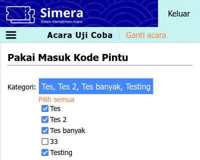
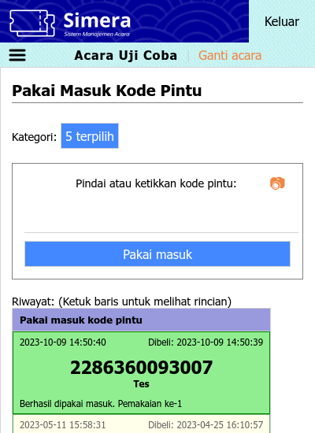

<title>Petugas pintu</title>

[Beranda](..) &raquo; [Panduan pengguna](.) &raquo; 
# Petugas pintu

## Masuk ke sistem
1. Kunjungi situs sistem maha.simera.web.id
1. Masukkan ID pengguna "GATECREWXXXX", di mana XXXX adalah nomor urut
1. Masukkan 6 digit PIN yang sudah diberitahukan sebelumnya
1. Klik tombol "Masuk"
1. Klik salah satu acara yang diinginkan
1. Pada tampilan seluler, klik ikon hamburger di sebelah kiri atas untuk mengakses menu

## Menu Pintu
### Pakai Masuk
Tautan: https://maha.simera.web.id/pakai_masuk
Menu ini digunakan untuk memakai masuk kode pintu yang belum pernah dipakai masuk, atau kode pintu yang sebelumnya sudah dipakai keluar. Hanya 25 data terakhir yang dapat ditampilkan.

1. Klik tombol di samping label "Kategori:"
1. Lepas centang pada kategori-kategori yang tidak ingin dipakai masuk
   
1. Jika menggunakan alat pemindai:
   1. Aktifkan kursor dengen mengeklik kotak teks
   1. Tekan dan tahan tombol pindai pada alat
   1. Arahkan pemindai ke kode, lalu lepaskan tombol pindai
1. Jika menggunakan papan ketik:
   1. Aktifkan kursor dengen mengeklik kotak teks
   1. Ketikkan kode pintu secara manual
   1. Tekan Enter, atau klik tombol "Periksa"
1. Jika menggunakan kamera:
   1. Aktifkan kamera dengen mengeklik ikon &#x1F4F7;&#xFE0E;
   1. Arahkan kamera ke kode hingga terdengar [bunyi seperti ini](https://maha.simera.web.id/aset/suara/Cursor1.ogg)
1. Hasil akan ditampilkan di paling atas dalam tabel riwayat
   1. Jika hijau dan terdengar [bunyi seperti ini](https://maha.simera.web.id/aset/suara/Chime1.ogg), berarti kode pintu berhasil dipakai masuk
   1. Jika merah dan terdengar [bunyi seperti ini](https://maha.simera.web.id/aset/suara/Buzzer1.ogg), berarti kode pintu gagal dipakai masuk
   1. Jika putih, berarti kode pintu sedang diproses. Jika tidak berubah sekian lama, pastikan Internet stabil, lalu klik pada baris tersebut untuk mencoba kembali.
   

### Pakai Keluar
Tautan: https://maha.simera.web.id/pakai_keluar
Menu ini digunakan untuk memakai keluar kode pintu yang sebelumnya sudah dipakai masuk. Hanya 25 data terakhir yang dapat ditampilkan.

Untuk cara penggunaan, silakan lihat panduan [Pakai masuk](#pakai-masuk).

### Periksa
Tautan: https://maha.simera.web.id/periksa
Menu ini digunakan untuk memeriksa kode pintu, apakah terdaftar, dan apakah sudah dipakai. Hanya 1 data yang ditampilkan.

1. Jika menggunakan alat pemindai:
   1. Aktifkan kursor dengen mengeklik kotak teks
   1. Tekan dan tahan tombol pindai pada alat
   1. Arahkan pemindai ke kode, lalu lepaskan tombol pindai
1. Jika menggunakan papan ketik:
   1. Aktifkan kursor dengen mengeklik kotak teks
   1. Ketikkan kode pintu secara manual
   1. Tekan Enter, atau klik tombol "Periksa"
1. Jika menggunakan kamera:
   1. Aktifkan kamera dengen mengeklik ikon &#x1F4F7;&#xFE0E;
   1. Arahkan kamera ke kode hingga terdengar [bunyi seperti ini](https://maha.simera.web.id/aset/suara/Cursor1.ogg)
1. Hasil akan ditampilkan di bawah
   1. Jika hijau, berarti kode pintu ditemukan
   1. Jika merah, berarti kode pintu tidak ditemukan
   
