<title>Catatan rilis sistem dan situs web | Cara Simera</title>

[Beranda](..) &raquo; [Catatan rilis](.) &raquo; 
# Sistem dan situs web (Terbaru)

<blockquote>

**Daftar isi**

<!-- @import "[TOC]" {cmd="toc" depthFrom=2 depthTo=2} -->
<!-- code_chunk_output -->

- [26 Agustus 2025](#26-agustus-2025)
- [18 Agustus 2025](#18-agustus-2025)
- [12 Agustus 2025](#12-agustus-2025)
- [6 Agustus 2025](#6-agustus-2025)
- [22 Juli 2025](#22-juli-2025)
- [14 Juli 2025](#14-juli-2025)
- [8 Juli 2025](#8-juli-2025)
- [1 Juli 2025](#1-juli-2025)
- [Yang lebih lama](#yang-lebih-lama)
- [Informasi lebih lanjut](#informasi-lebih-lanjut)

<!-- /code_chunk_output -->

</blockquote>

---

## 26 Agustus 2025

|           | Sistem  | Situs web |
| --------- |:-------:|:---------:|
| **Versi** |`b627b55`|`e320b38`  |

### Perubahan
   
**Peningkatan fitur:**
1. Di kirim pesanan, fungsi tetapkan kursi sudah bisa digunakan
2. Di kirim pesanan, ada tombol "lihat kode penukaran"
   
   Jadi pesanan dengan status 'terbit' bisa dilihat juga kode penukarannya, tidak harus menunggu statusnya menjadi 'selesai'
3. Di daftar lengkap pesanan, pesanan yang berstatus selesai bisa dikembalikan untuk diganti nomor kursinya
4. Di daftar lengkap pesanan, pesanan yang paling baru akan muncul di atas (seperti di daftar acara)
5. [Mobile app] Penambahan informasi kategori kode penukaran dan kode pintu saat sinkronisasi kirim

**Perbaikan bug:**
1. Di cetak rincian pesanan, jika penyalur bukan Simera, nomor kursi tidak muncul 
2. Di daftar lengkap pesanan, jika penyalur bukan Simera, saat tombol "lihat kode penukaran" diklik, hasilnya kosong karena ada perbedaan penyalur
3. Di daftar lengkap pesanan, jika filter dipilih "Status pesanan: Disimpan", saat unduh ke CSV, filter tersebut diabaikan

_Tidak ada halaman baru di rilis ini._

---

## 18 Agustus 2025

|           | Sistem  | Situs web |
| --------- |:-------:|:---------:|
| **Versi** |`8264856`|`e320b38`  |

### Perubahan

**Halaman baru:**
1. Halaman kirim pesanan
   
   Fungsi kirim rincian pesanan sekarang berada di halaman ini. Nomor kursi untuk masing-masing kode penukaran nantinya bisa diatur di sini. Selain itu, ada juga penambahan fungsi untuk membatalkan terbitan atau menunda pengiriman rincian. Pembatalan terbitan juga akan menghapus kode penukaran terkait.
   
**Peningkatan fitur:**
1. Di daftar lengkap pesanan, saat penyalur dipilih "(Semua penyalur)", akan muncul kolom baru: "Penyalur" di hasil unduh ke CSV
2. Di bayar pesanan, jumlah rincian ditampilkan di samping harga untuk konfirmasi
3. Di bayar pesanan, fungsi kirim rincian pesanan dihapus dari sini, dan dipindah ke kirim pesanan
4. Di bayar pesanan, pilihan tindakan diubah menjadi radio button, hanya ada satu tombol lanjut sekarang

**Perbaikan bug:**
1. Saat ada yang bertindak tanpa masuk log (seperti pelanggan membuka rincian pesanan dan mengirim ulang), ada kemungkinan kueri database tidak tercatat di log
2. Saat pelanggan membuka kembali rincian pesanan di mana penerbitan kode penukaran sudah dibatalkan atau belum diterbitkan, akan terjadi masalah di kode QR karena kodenya kosong

### Tangkapan layar

- _Peningkatan #2 dan #3 - Sebelum_
   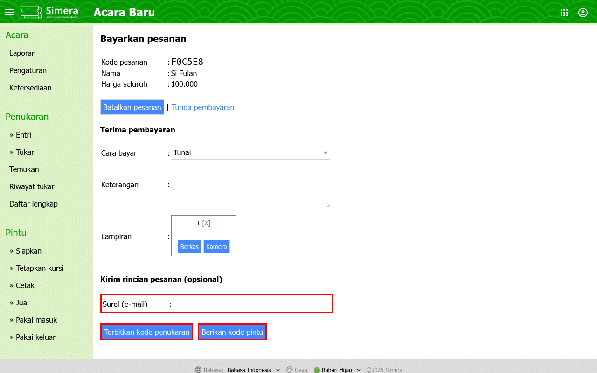
- _Peningkatan #2 dan #3 - Sesudah_
   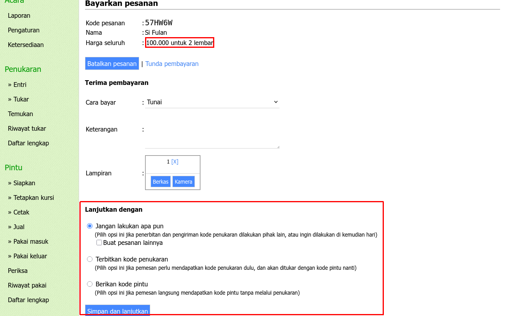
- _Halaman baru #1_
   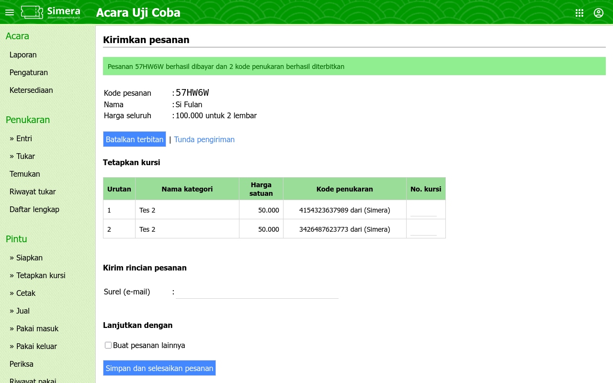

---

## 12 Agustus 2025

|           | Sistem  | Situs web |
| --------- |:-------:|:---------:|
| **Versi** |`b263c94`|`e320b38`  |

### Perubahan

**Peningkatan fitur:**
1. Di daftar lengkap pesanan, ada filter baru: "Status pesanan: Disimpan"
2. Di daftar lengkap pesanan, saat penyalur dipilih "(Semua penyalur)" akan muncul kolom baru: "Penyalur"
3. Penambahan ringkasan di daftar lengkap pesanan
   
   Jadi kalau mau lihat berapa banyak yang terjual, atau yang belum dibayar, dsb bisa langsung halaman ini, tidak perlu ekpor ke CSV lagi terus SUM/COUNT manual.
4. Penambahan fungsi untuk membatalkan pesanan atau menunda pembayaran di bayar pesanan
   
   Sama seperti di situs penjualan di mana pelanggan bisa membatalkan pesanannya sendiri dan tidak lanjut ke pembayaran, sekarang internal order pun bisa dibatalkan. Statusnya bisa difilter di menu daftar pesan.

_Tidak ada halaman baru dan perbaikan bug di rilis ini._

### Tangkapan layar

- _Peningkatan fitur #1, #2 dan #3_
   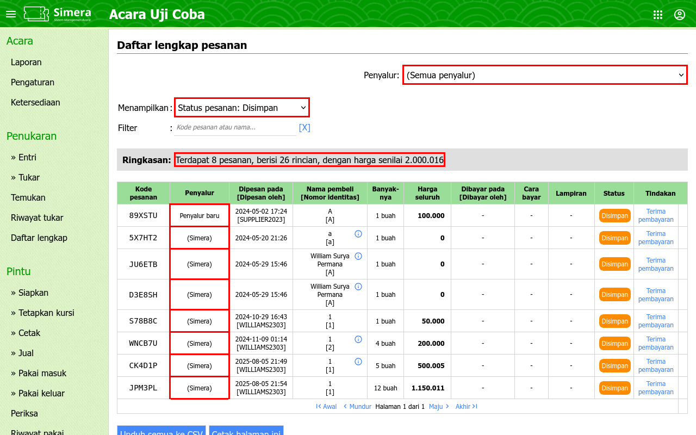

---

## 6 Agustus 2025

|           | Sistem  | Situs web |
| --------- |:-------:|:---------:|
| **Versi** |`8374b41`|`e320b38`  |

### Perubahan

**Peningkatan fitur:**
1. Metode baru di siapkan kode pintu versi inject (requestnya dipecah kecil-kecil, dan penambahan progress bar)
2. Penambahan menu untuk ke coba.simera.web.id dan mini.simera.web.id dari menu header
3. Maksimum per pesanan bisa dibuat hingga 50 di ketersediaan acara
4. Jika boleh membeli >12, banyaknya bisa diketik manual dalam textbox, tidak memilih dari dropdown lagi di buat pesanan
5. [Situs web] Deteksi otomatis bahasa di pengaturan perangkat/sistem. Jika menggunakan OS bahasa Inggris, otomatis halaman ditampilkan dalam bahasa Inggris
6. [Situs web] Penambahan separator di pilihan kategori penjualan

**Perbaikan bug:**
1. [Situs web] Saat menembak ID acara di URL, atau membagikan link, untuk acara yang seharusnya tidak dibuka untuk penjualan, judul halaman (saat dibuka), gambar dan keterangan (saat link dibagikan) masih menampilkan informasi dari acara tersebut

_Tidak ada halaman baru di rilis ini._

### Tangkapan layar

- _Peningkatan fitur #4_
   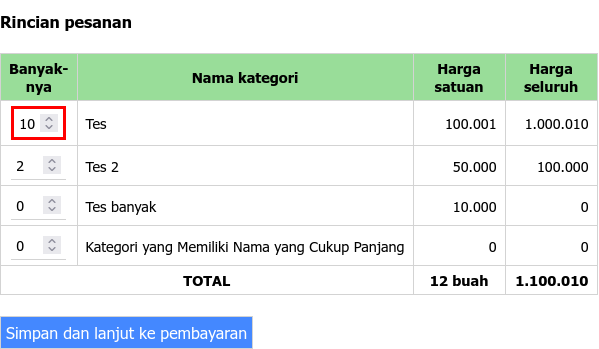

---

## 22 Juli 2025

|           | Sistem  | Situs web |
| --------- |:-------:|:---------:|
| **Versi** |`0bff0ba`|`deecfa3`  |

### Perubahan

**Peningkatan fitur:**
1. Optimasi kueri dan koneksi DB di siapkan kode pintu versi generate (prosesnya akan semakin cepat)
2. Optimasi kueri dan koneksi DB di siapkan kode pintu versi inject (belum termasuk progress bar di frontend)
3. Opsi 'Timpa' juga tersedia di siapkan kode pintu versi generate (sebelumnya hanya ada di versi inject)
4. Perubahan nama menu: Batas penjualan -> Ketersediaan
5. Perubahan ikon (kamera, kartu, lampiran, dsb) dari simbol/emoji ke SVG, agar tampilannya seragam di semua perangkat
6. [Situs web] Hapus link ke penjualan di header

_Tidak ada halaman baru dan perbaikan bug di rilis ini._

### Tangkapan layar

- _Peningkatan fitur #3 dan #4_
   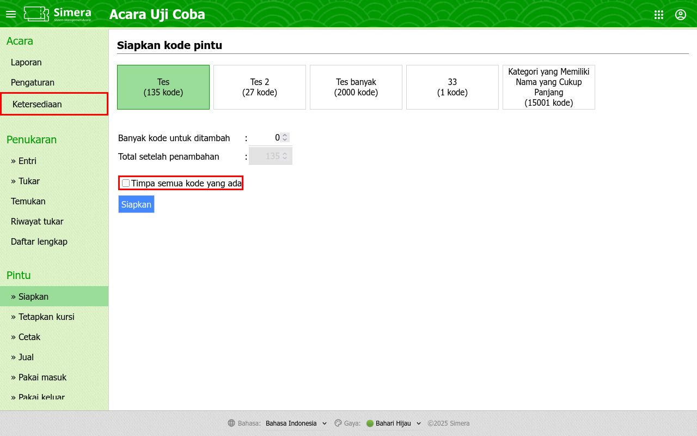

---

## 14 Juli 2025

|           | Sistem  | Situs web |
| --------- |:-------:|:---------:|
| **Versi** |`bc0a44f`|`d055544`  |

### Perubahan

**Halaman baru:**
1. Halaman beranda
   
   Pengganti halaman pilih acara. Di sini akan terlihat berapa acara yang dimiliki tiap penyelenggara. Ada filter juga, cari acara yang lama lebih gampang.

**Peningkatan fitur:**
1. Revamp menu (lanjutan)
   
   Menu kategori Kelola sekarang muncul di halaman beranda. Akses kelola pengguna lebih gampang, tidak perlu pindah ke kelola acara dulu, langsung bisa diklik dari depan.
2. Metode baru di siapkan kode pintu versi generate
   
   Perubahan metode kirim form data untuk mengatasi "Request Time Out" saat siapkan kode pintu: dari single request single response (saat banyak yang disiapkan, requestnya membesar dan server tak punya cukup waktu nuntuk proses) menjadi multiple request multiple response di mana requestnya dipecah kecil-kecil. Harapannya setiap requestnya tidak perlu waktu lama, dan tidak RTO lagi. Sekarang ada progress barnya juga.
3. Muat ulang peran dan hak akses di kelola akun
   
   Saat ada perubahan role atau penambahan menu baru, sekarang bisa buka halaman kelola akun dari kanan atas. Tidak harus logout dan login lagi.

_Tidak ada perbaikan bug di rilis ini._

### Tangkapan layar

- _Halaman baru #1 dan Peningkatan fitur #1_
   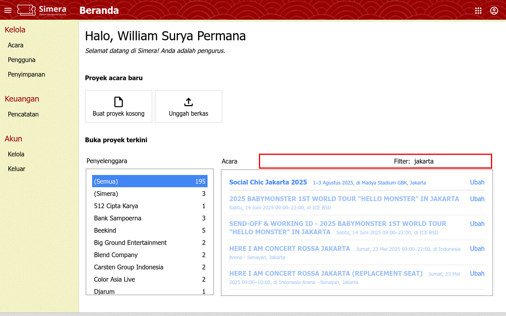
- _Peningkatan fitur #2_
   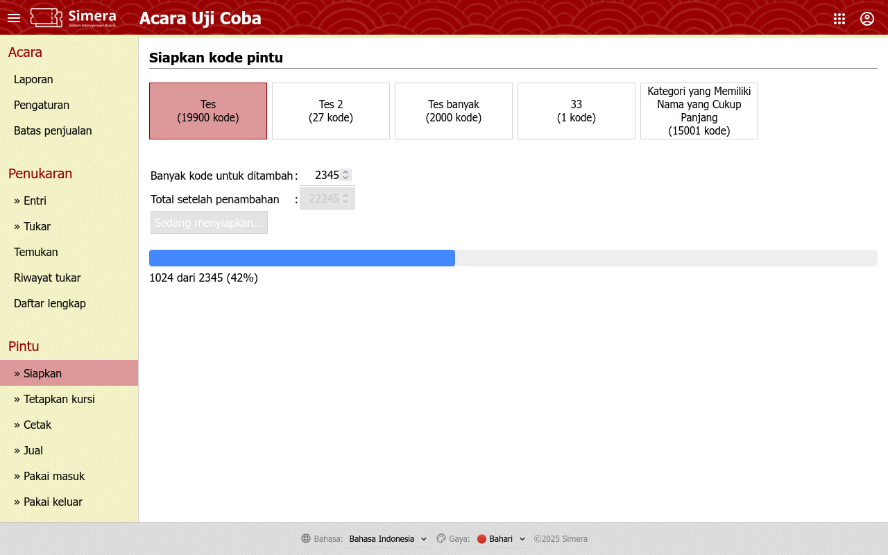

---

## 8 Juli 2025

|           | Sistem  | Situs web |
| --------- |:-------:|:---------:|
| **Versi** |`6902d42`|`d055544`  |

### Perubahan

**Peningkatan fitur:**
1. Revamp menu (lanjutan)
   
   Header kini sebaris saja, lebih banyak ruang untuk konten utama. Di sini terlihat ID pengguna yang login. Nama dan perannya juga selalu muncul (sebelumnya hanya ada di versi desktop, di versi mobile hanya ada link logout). Ada juga link ke aplikasi domain simera yang lain, tidak perlu lagi bookmark manual.
2. Bisa paksa pakai keluar di daftar lengkap kode pintu
   
   Ini bisa dipakai untuk satu kode yang bisa dipakai berhari-hari, tapi saat akhir hari tidak mau di pakai keluar satu-satu (meskipun saat beli bundling dapatnya hanya satu kode, bukan sesuai jumlah harinya).
   
   Di daftar lengkap kode pintu, pilih kategorinya, pilih tampilkan yang sudah dipakai, nanti muncul tombolnya di bawah.

**Perbaikan bug:**
1. Pakai masuk/pakai keluar/tukar terkadang bakal terus "Gagal diperiksa" setelah integrasi mobile app (misal saat buka tab baru lalu ganti acara, atau sesinya habis). Seharusnya diredirect dan muncul error message, seperti dulu sebelum integrasi mobile app.
2. Terjemahan bahasa Inggris yang hilang untuk judul menu Batas penjualan.
3. Unhandled case di mana pengguna sistem klik "Lihat log" di cetak rincian pesanan, tapi pelanggan belum pernah buka e-vouchernya.

_Tidak ada halaman baru di rilis ini._

### Tangkapan layar

- _Peningkatan fitur #1 - Sebelum_
   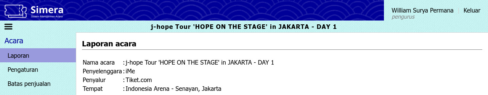
- _Peningkatan fitur #1 - Sesudah_
   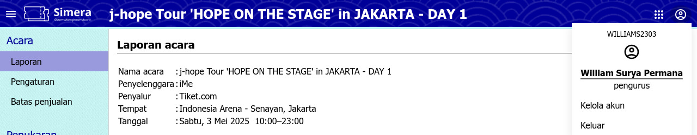
- _Peningkatan fitur #2_
   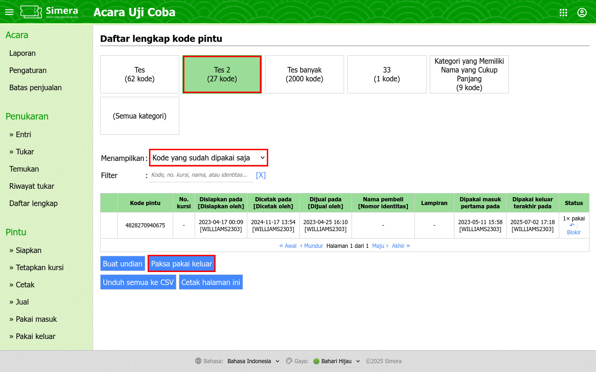

---

## 1 Juli 2025

|           | Sistem  | Situs web |
| --------- |:-------:|:---------:|
| **Versi** |`2ec2770`|`d055544`  |

### Perubahan

**Peningkatan fitur:**
1. Revamp menu
   
   Menu kini dibedakan antara sebelum dan setelah pilih acara agar lebih ringan. Masih Work in Progress, sehingga saat mau buka menu kategori "Kelola" harus sebelum pilih acara, klik "Kelola acara" di depan, nanti menunya muncul di kiri. Kalau sudah terlanjur pilih acara, bisa klik logo Simera di kiri atas untuk balik ke depan.
2. Bisa hapus pesanan di hapus data
   
   Catatan: pesanan dan kode pintu disimpan di tabel terpisah. Hapus kode pintu tidak akan langsung menghapus pesanan (karena belum tentu kodenya diterbitkan dari menu pesanan), begitu juga sebaliknya (karena belum tentu pesanannya sudah paid/issued). Jika ada keduanya, silakan dihapus satu per satu.

_Tidak ada halaman baru dan perbaikan bug di rilis ini._

### Tangkapan layar

- _Peningkatan fitur #2_
   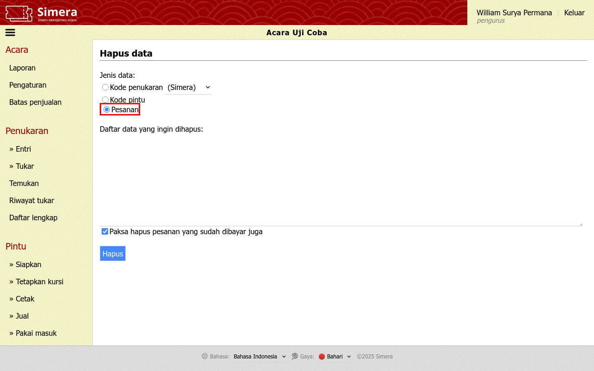

---

## Yang lebih lama

- [2025 H1](./utama_2025H1)

---

## Informasi lebih lanjut

Silakan buka diskusi di grup "System Update", atau hubungi William Surya Permana.

---

_Akhir dari dokumen_ &#x7C; [Kembali ke atas](#)