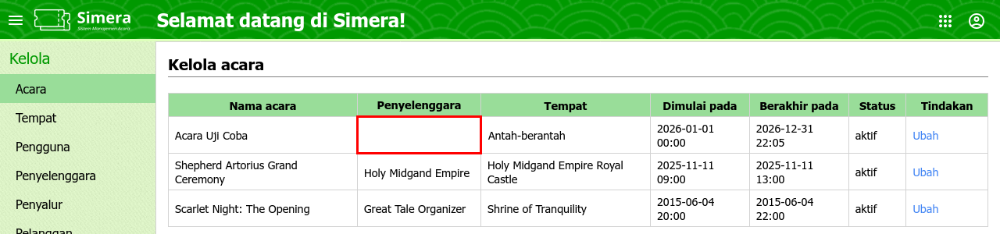
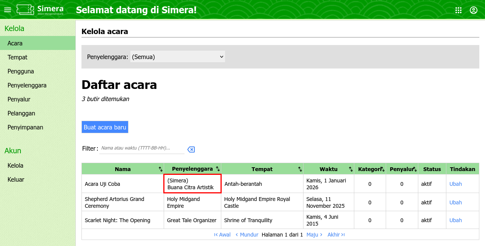

<title>Catatan rilis sistem dan situs web | Cara Simera</title>

[Beranda](..) &raquo; [Catatan rilis](.) &raquo; 
# Sistem dan situs web (Terbaru)

<blockquote>

**Daftar isi**

<!-- @import "[TOC]" {cmd="toc" depthFrom=2 depthTo=2} -->
<!-- code_chunk_output -->

- [26 Februari 2026](#26-februari-2026)
- [12 Februari 2026](#12-februari-2026)
- [29 Januari 2026](#29-januari-2026)
- [8 Januari 2026](#8-januari-2026)
- [Yang lebih lama](#yang-lebih-lama)
- [Informasi lebih lanjut](#informasi-lebih-lanjut)

<!-- /code_chunk_output -->

</blockquote>

---

## 26 Februari 2026

|           | Sistem  | Situs web |
| --------- |:-------:|:---------:|
| **Versi** |`b339e68`|`3b5042b`  |

### Perubahan

**Peningkatan fitur:**
1. Revamp kelola acara
   
   Halaman ini menampilkan semua acara yang terdaftar berdasarkan penyelenggaranya, berikut kategori dan penyalur yang terhubung dengannya. Ada filter juga, cari pengguna menurut nama dan waktu jadi lebih mudah.
2. Di beranda, ditambahkan link untuk kelola acara dari penyelenggara yang dipilih
3. Di kelola pengguna, jumlah pengguna per peran sekarang juga dimunculkan di tampilan seluler
4. Di kelola tempat, jumlah tempat per provinsi sekarang juga dimunculkan di tampilan seluler

**Perbaikan bug:**
1. Di menu kelola acara, penyelenggara tidak tampil jika acara terhubung ke lebih dari satu penyelenggara
2. Di menu pengaturan konten, bahasa tampilan tidak bisa diubah di footer karena konflik dengan pilihan bahasa konten
3. Di menu-menu kelola, tombol, kotak teks, dan kotak pilihan muncul lebih besar dari labelnya saat mengubah data di tampilan seluler

_Tidak ada halaman baru di rilis ini._

### Tangkapan layar

- _Peningkatan fitur #1 - Sebelum dan Perbaikan bug #1_
   
- _Peningkatan fitur #1 - Sesudah dan Perbaikan bug #1_
   

---

## 12 Februari 2026

|           | Sistem  | Situs web |
| --------- |:-------:|:---------:|
| **Versi** |`1d4ffaf`|`3b5042b`  |

### Perubahan

**Peningkatan fitur:**
1. Di hapus data, keseluruhan data dari acara yang dipilih kini bisa dihapus oleh pengurus
2. Pengguna otomatis bisa mengakses halaman versi lama (seperti /pengguna_v1, /pakai_masuk_v1, dsb) jika mendapat akses untuk versi baru, tanpa harus diberikan hak aksesnya secara manual
3. Peningkatan pustaka multiselect dari versi 2.4.1 ke 2.4.24. Tombol pilihan di cetak, pakai masuk, pakai keluar, dan tukar akan mengalami sedikit perubahan tampilan.

**Perbaikan bug:**
1. Di kelola penyelenggara, penyelenggara baru tidak dapat dibuat
2. Di kelola penyalur dan kelola pelanggan, lebar kolom pada tabel data tidak diatur dengan benar
3. Di kelola penyalur, kelola pelanggan, dan kelola tempat, nama dengan simbol tertentu tidak sepenuhnya ditampilkan sebagai judul saat mengubah data

_Tidak ada halaman baru di rilis ini._

---

## 29 Januari 2026

|           | Sistem  | Situs web |
| --------- |:-------:|:---------:|
| **Versi** |`47fb95a`|`3b5042b`  |

### Perubahan

**Peningkatan fitur:**
1. Di sinkronisasi, bagian pencadangan dan pemulihan dari aplikasi seluler kini bisa diakses oleh petugas pintu

_Tidak ada halaman baru dan perbaikan bug di rilis ini._

---

## 8 Januari 2026

|           | Sistem  | Situs web |
| --------- |:-------:|:---------:|
| **Versi** |`9258fca`|`3b5042b`  |

### Perubahan

**Peningkatan fitur:**
1. Di kelola tempat, ada fitur untuk mengubah dan menambahkan negara, provinsi, dan kota
2. Di sinkronisasi, bagian pemulihan dari aplikasi seluler, ada pengecekan jika acara terpilih tidak sesuai dengan data pencadangan
3. Di sinkronisasi, bagian pemulihan dari aplikasi seluler, khusus via API, hasil pemulihan akan langsung ditampilkan langsung di layar, tidak lagi berupa file

**Perbaikan bug:**
1. Di sinkronisasi, bagian pemulihan dari aplikasi seluler, berkas gagal diproses jika informasi pengguna tidak dikirimkan ulang
2. Kesalahan penulisan nama pada beberapa kota di Indonesia
3. Di beranda, acara yang belum terhubung ke penyelenggara tidak muncul meski sudah difilter "(Semua)"

_Tidak ada halaman baru di rilis ini._

---

## Yang lebih lama

- [2025 H2](./utama_2025H2)

---

## Informasi lebih lanjut

Silakan buka diskusi di grup "System Update", atau hubungi William Surya Permana.

---

_Akhir dari dokumen_ &#x7C; [Kembali ke atas](#)
