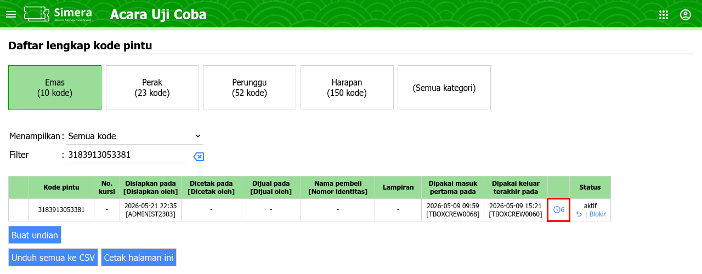

<title>Catatan rilis sistem dan situs web | Cara Simera</title>

[Beranda](..) &raquo; [Catatan rilis](.) &raquo; 
# Sistem dan situs web (Terbaru)

<blockquote>

**Daftar isi**

<!-- @import "[TOC]" {cmd="toc" depthFrom=2 depthTo=2} -->
<!-- code_chunk_output -->

- [4 Agustus 2026](#4-agustus-2026)
- [28 Juli 2026](#28-juli-2026)
- [21 Juli 2026](#21-juli-2026)
- [7 Juli 2026](#7-juli-2026)
- [Yang lebih lama](#yang-lebih-lama)
- [Informasi lebih lanjut](#informasi-lebih-lanjut)

<!-- /code_chunk_output -->

</blockquote>

---

## 4 Agustus 2026

|           | Sistem  | Situs web |
| --------- |:-------:|:---------:|
| **Versi** |`e3e3d29`|`eed1ac0`  |

### Perubahan

**Peningkatan fitur:**
1. Di daftar lengkap kode pintu, informasi jumlah pakai dipindah dari kolom "status" ke "durasi".

   Informasi jumlah pakai (dan durasi) akan muncul tanpa memedulikan status kode pintu, asalkan sudah pernah dipakai keluar. Dulu, jumlah pakai tidak muncul jika statusnya adalah diblokir. Sekarang, informasi status menjadi jelas karena tidak akan berubah menjadi jumlah pakai lagi jika statusnya adalah aktif.
2. Optimasi kueri saat hapus kategori di pengaturan acara
3. Optimasi rendering menu di header dengan memindah JavaScript dari inline ke eksternal

**Perbaikan bug:**
1. Di daftar kode pintu, durasi gagal ditampilkan saat diklik (efek peningkatan fitur #4 rilis [8 Juni 2026](./utama_2026H1#8-juni-2026))
2. Di entri kode penukaran dan jual kode pintu, kotak teks tidak dapat diisi dan ketikan muncul di panel pemindai kode (efek rilis 30 Desember 2024)
3. Tampilan kamera tidak muncul setelah dibuka untuk kedua kalinya dan seterusnya saat menambah lampiran menggunakan kamera (khusus Chrome)

_Tidak ada halaman baru di rilis ini._

### Tangkapan layar

- _Peningkatan fitur #1 dan #2_
   

---

## 28 Juli 2026

|           | Sistem  | Situs web |
| --------- |:-------:|:---------:|
| **Versi** |`eaef779`|`eed1ac0`  |

### Perubahan

**Peningkatan fitur:**
1. Pengarsipan kode lama sebelum revamp (lanjutan). API lama dipisahkan dari API yang digunakan saat ini.
2. Penyesuaian fungsi remot ke peladen lokal karena ada perubahan di sisi pihak ketiga
3. Penyesuaian kamera yang digunakan untuk memindai dan menambah lampiran jika perangkat memiliki banyak kamera
4. Optimasi kueri di perhitungan jumlah kode penukaran dan kode pintu per kategori

**Perbaikan bug:**
1. Muncul kotak peringatan saat menambah lampiran menggunakan kamera (efek peningkatan fitur #3 rilis [7 Juli 2026](#7-juli-2026))

_Tidak ada halaman baru di rilis ini._

---

## 21 Juli 2026

|           | Sistem  | Situs web |
| --------- |:-------:|:---------:|
| **Versi** |`eb8facc`|`eed1ac0`  |

### Perubahan

**Peningkatan fitur:**
1. Pengarsipan kode lama sebelum revamp. Versi lama dari beranda, menu kelola acara, kelola pengguna, entri kode penukaran, dan siapkan kode pintu bisa diakses dengan URL khusus.

**Perbaikan bug:**
1. Muncul kotak peringatan terus menerus saat pemindai kamera tidak menemukan kode QR atau barcode (efek peningkatan fitur #3 rilis [7 Juli 2026](#7-juli-2026))

_Tidak ada halaman baru di rilis ini._

---

## 7 Juli 2026

|           | Sistem  | Situs web |
| --------- |:-------:|:---------:|
| **Versi** |`ecdafd2`|`eed1ac0`  |

### Perubahan

**Peningkatan fitur:**
1. Revamp entri kode penukaran
   
   Informasi nama penyalur yang aktif kini ditampilkan. Berpindah penyalur dan kategori sekarang tidak memerlukan muat ulang halaman sehingga menjadi lebih cepat.
2. Implementasi model voucer untuk buat/perbarui/hapus data di entri kode penukaran, bayar pesanan, dan hapus data
3. Optimasi pemindaian kamera dan NFC serta opsi layar penuh di semua halaman dengan memindah JavaScript dari inline ke eksternal
4. Optimasi foto via kamera dan unggah berkas di semua halaman dengan memindah JavaScript dari inline ke eksternal

_Tidak ada halaman baru dan perbaikan bug di rilis ini._

---

## Yang lebih lama

- [2026 H1](./utama_2026H1)

---

## Informasi lebih lanjut

Silakan buka diskusi di grup "System Update", atau hubungi William Surya Permana.

---

_Akhir dari dokumen_ &#x7C; [Kembali ke atas](#)
