<title>Catatan rilis sistem dan situs web | Cara Simera</title>

[Beranda](..) &raquo; [Catatan rilis](.) &raquo; 
# Sistem dan situs web (2025 H1)
&laquo; [Kembali ke terbaru](./utama.md) 

> **Daftar isi**
> 
> - [23 Juni 2025](#23-juni-2025)
> - [16 Juni 2025](#16-juni-2025)
> - [5 Juni 2025](#5-juni-2025)
> - [27 Mei 2025](#27-mei-2025)
> - [20 Mei 2025](#20-mei-2025)
> - [10 Mei 2025](#10-mei-2025)
> - [5 Mei 2025](#5-mei-2025)
> - [Yang lebih lama](#yang-lebih-lama)
> - [Informasi lebih lanjut](#informasi-lebih-lanjut)

---

## 23 Juni 2025

|           | Sistem  | Situs web |
| --------- |:-------:|:---------:|
| **Versi** |`bd76a3e`|`d055544`  |

### Perubahan

**Peningkatan fitur:**
1. Bisa atur maksimum per pesanan di batas penjualan
   Per acara, per penyalur, bisa diatur dalam satu pesanan bisa beli sampai berapa. Jadi misal diset 6, nanti pas buat pesanan cuma bisa 6 maksimum (sebelumnya pasti bisa sampai 10).
   .
2. [Situs web] Persiapan untuk microsite dan whitelabel.
3. [Situs web] Saat share link acara di WA, FB, dkk, kini muncul nama dan gambarnya.
4. [Situs web] Implementasi maksimum per pesanan.
Cara aturnya sama seperti nomor 1 (sebelumnya pasti bisa sampai 5).

**Perbaikan bug:**
1. Di pilih acara, acara yang sama muncul lebih dari sekali jika punya beberapa penyelenggara.
2. [Situs web] Muncul kotak gambar rusak saat gambar versi bahasa Inggris belum diatur di pengaturan konten (seharusnya pakai gambar versi bahasa Indonesia)

_Tidak ada halaman baru di rilis ini._

### Tangkapan layar

- _Peningkatan fitur #1 - Atur_
  .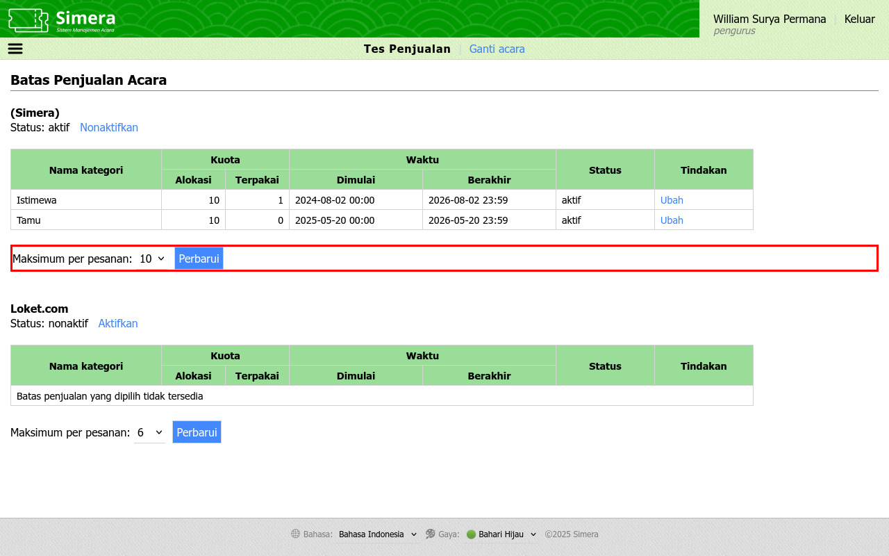
- _Peningkatan fitur #1 - Hasil_
  .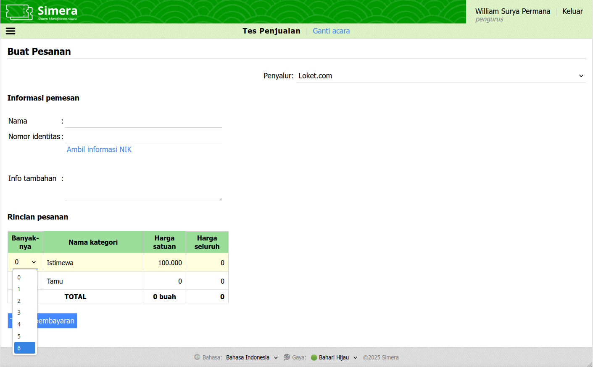
- _Peningkatan fitur #3 - Sebelum_
  .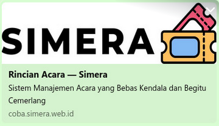
- _Peningkatan fitur #3 - Sesudah_
  .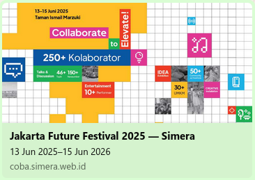
- _Peningkatan fitur #4_
  .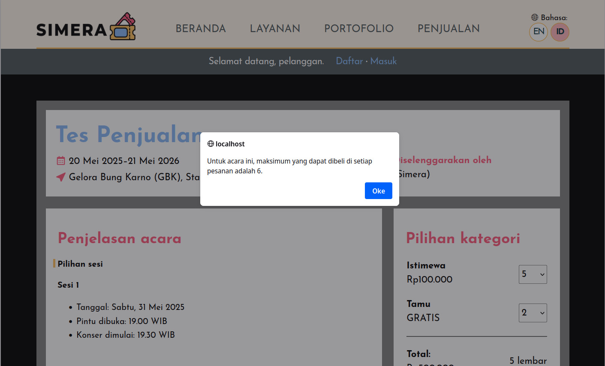
---

## 16 Juni 2025

|           | Sistem  | Situs web |
| --------- |:-------:|:---------:|
| **Versi** |`24bd5d4`|`8a12b2c`  |

### Perubahan

**Peningkatan fitur:**
1. Data pakai keluar kode pintu dari mobile app sudah bisa direstore ke sistem
2. Data kode penukaran sudah dari sistem sudah bisa dibackup ke mobile. Bisa dipakai saat penukaran mau pakai mobile apps juga. Tinggal dicentang data apa saja yang mau dipindah.
3. Saat restore dari mobile, kini bisa diketahui penggunanya, sehingga saat dieksekusi tidak lagi kelihatannya semua dipakai masuk/keluar oleh pengguna yang upload filenya ke sistem.
4. Hasil restore dari mobile kini berupa file dengan rincian lengkap yg bisa disimpan. Tidak lagi hanya muncul message sekian berhasil, sekian gagal.
5. Di kelola konten, untuk pemberitahuan pesanan selesai kini bisa diatur mulai darinya, perihalnya, sampe tembusannya (sebelumnya hanya isi emailnya yang bisa diatur). Jika ada perlu whitelabel, sudah bisa dicustom sendiri.

_Tidak ada halaman baru dan perbaikan bug di rilis ini._

### Tangkapan layar

- _Peningkatan fitur #2 dan #3_
  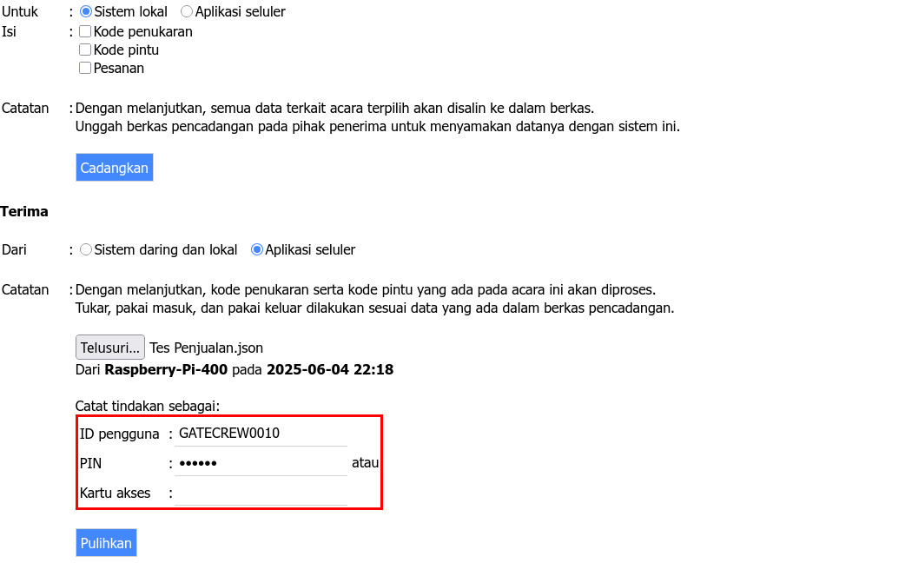
- _Peningkatan fitur #5_
  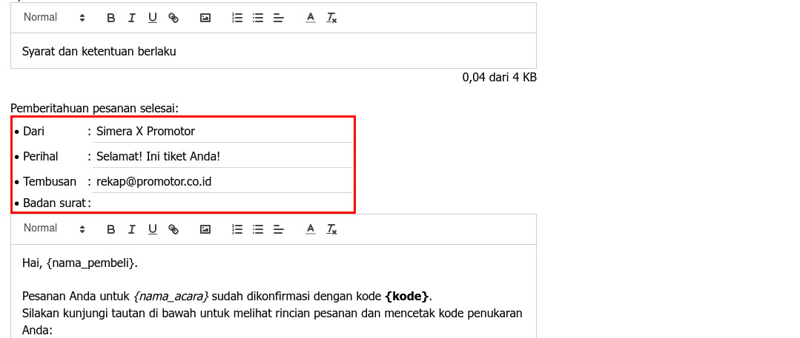

---

## 5 Juni 2025

|           | Sistem  | Situs web |
| --------- |:-------:|:---------:|
| **Versi** |`2009967`|`8a12b2c`  |

### Perubahan

**Peningkatan fitur:**
1. Data pakai masuk kode pintu dari mobile app sudah bisa direstore ke sistem.
2. [Situs web] Kategori yang Rp0 akan tertulis "GRATIS".
3. [Situs web] Link ke penyelenggara dinonaktifkan (sebelumnya jika diklik akan muncul 404).

**Perbaikan bug:**
1. [Situs web] Kesalahan kalkulasi jumlah hari untuk acara yang lebih dari satu hari.

_Tidak ada halaman baru di rilis ini._

### Tangkapan layar

- _Peningkatan fitur #2 dan #3_
  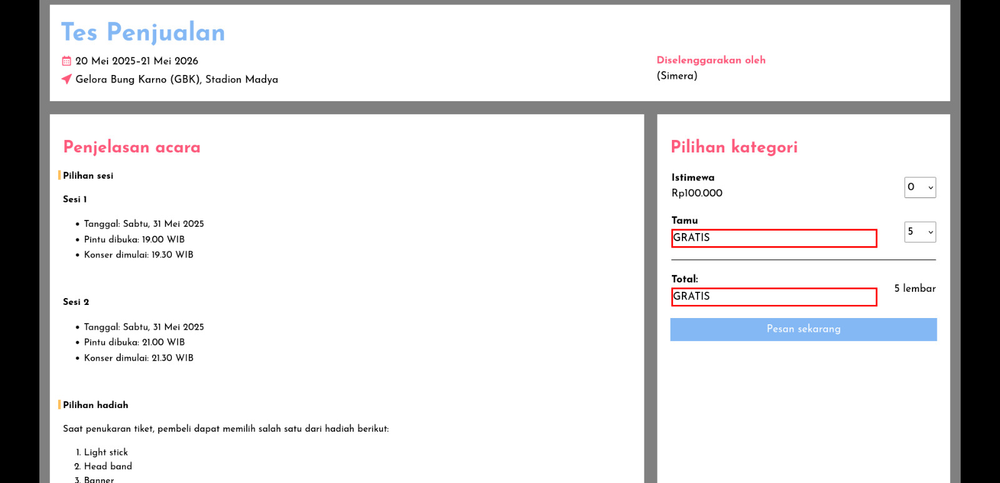

---

## 27 Mei 2025

|           | Sistem  | Situs web |
| --------- |:-------:|:---------:|
| **Versi** |`4b23863`|`31a0126`  |

### Perubahan

**Peningkatan fitur:**
1. Footer saat cetak diganti menjadi "Dikeluarkan/Generated" (sebelumnya "Disajikan/Presented").
2. Bisa set Heading untuk penjelasan acara dan syarat dan ketentuan di kelola konten (sebelumnya hanya ada Small, Normal, Big). 
   Ketik judul section barunya, di kiri atas, klik Normal, lalu pilih Heading.
   Ini bisa dipakai untuk menambahkan "Cara penukaran tiket" yang diminta, atau bahkan lebih banyak lagi. Misal mau ada mau ada "Cara ikut undian", "Cara pengambilan merchandise", "Cara pengembalian tiket", bisa, soalnya ini bukan kolom baru. Jadi, bisa dipilih juga mau langsung muncul di depan (penjelasan acara), atau muncul pas setuju (syarat dan ketentuan).
3. [Situs web] Implementasi fitur Heading untuk penjelasan acara dan syarat dan ketentuan di rincian acara
4. [Situs web] Kini acara yang dibuat untuk penjualan di cara.simera.web.id akan muncul di cara.simera.web.id/lamanlabuh.

_Tidak ada halaman baru dan perbaikan bug di rilis ini._

### Tangkapan layar

- _Peningkatan fitur #2_
  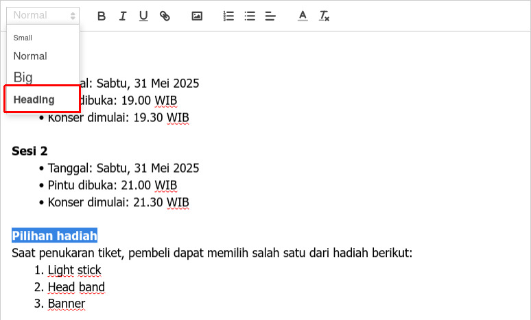
- _Peningkatan fitur #3_
  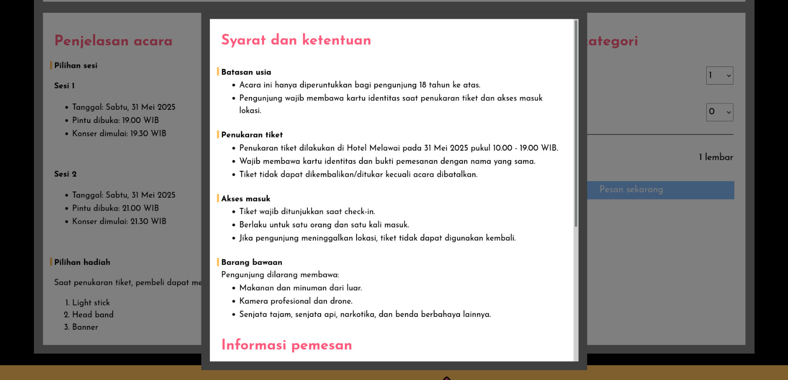

---

## 20 Mei 2025

|           | Sistem  | Situs web |
| --------- |:-------:|:---------:|
| **Versi** |`a38f26e`|`81f1716`  |

### Perubahan

**Peningkatan fitur:**
1. Saat klik link informasi di mana entri kode penukaran atau buat pesanan tidak tersedia karena penerbit kode tidak sesuai, penyalur yang dipilih akan langsung terbuka (sebelumnya harus pilih ulang)
2. Bisa lampirkan gambar untuk penjelasan acara, syarat dan ketentuan, dan pemberitahuan pesanan selesai di kelola konten. 
   Cari gambarnya di Internet (bisa gambar/logo yang udah diupload di halaman ini, atau minta promotor upload ke web/image hosting mereka), klik kanan, copy image link, terus paste di kotaknya.

**Perbaikan bug:**
1. Di kelola sesi pengguna, masih tarik data dari maha.simera.web.id di coba.simera.web.id.
2. Di kelola sesi pengguna, perkirakan browser terkadang mengembalikan nilai kosong.
3. Kesalahan autentikasi API mobile app di coba.simera.web.id

_Tidak ada halaman baru di rilis ini._

### Tangkapan layar

- _Peningkatan fitur #1 - Entri kode penukaran_
  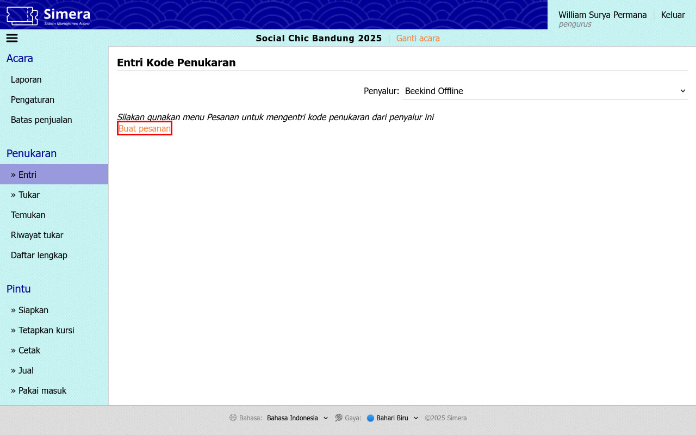
- _Peningkatan fitur #1 - Buat pesanan_
  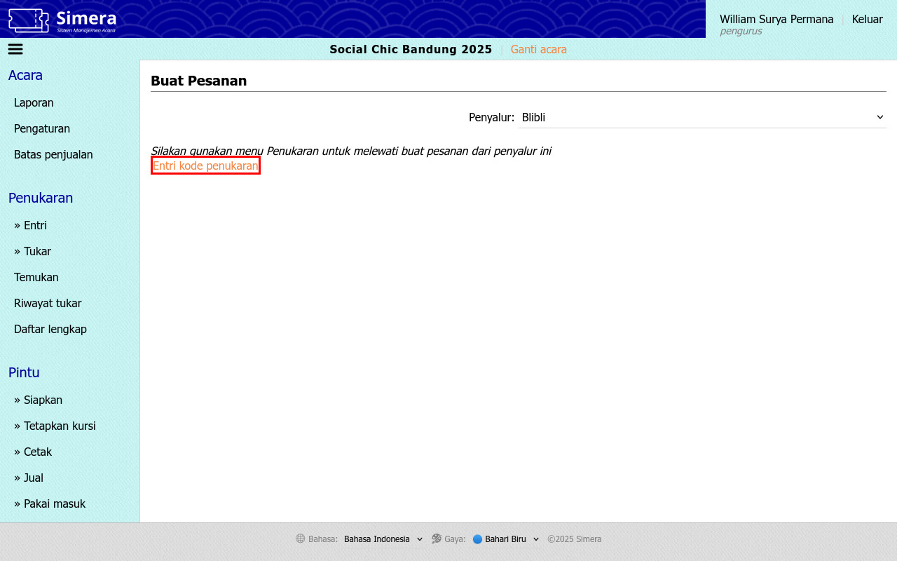
- _Peningkatan fitur #2 - Langkah 1_
  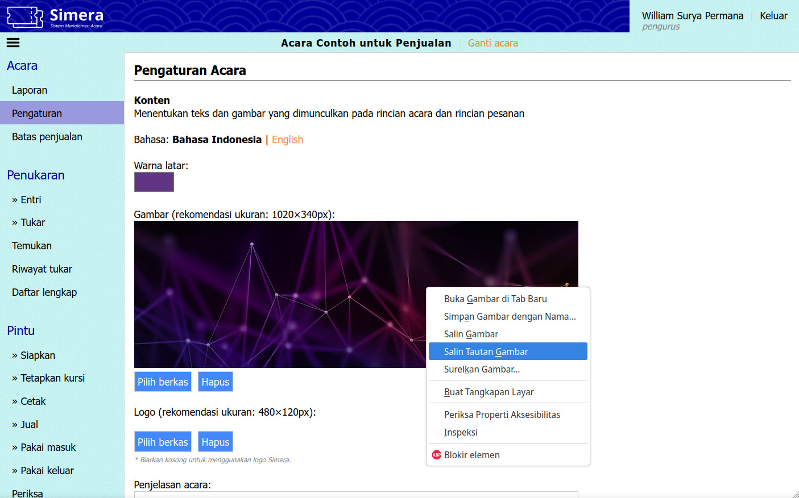
- _Peningkatan fitur #2 - Langkah 2_
  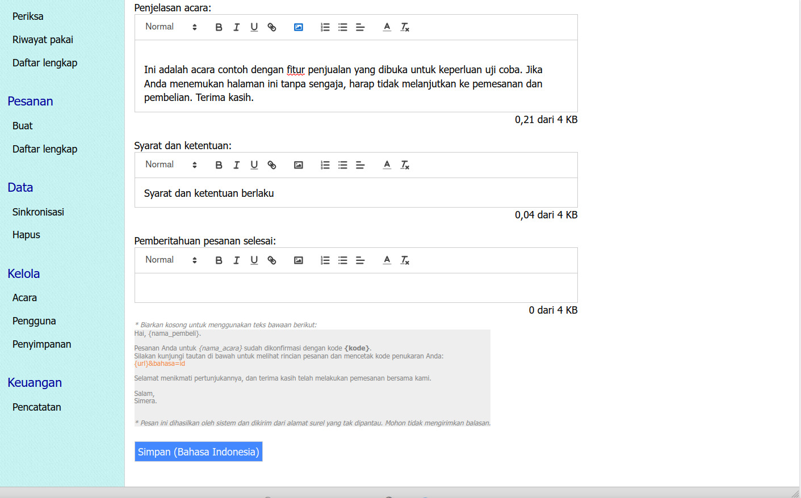
- _Peningkatan fitur #2 - Langkah 3_
  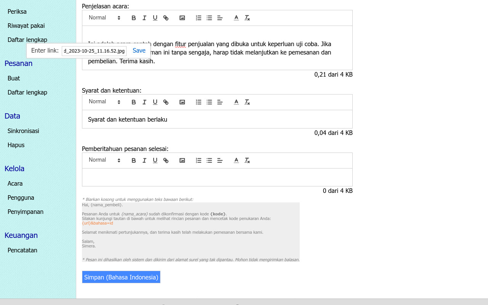
- _Peningkatan fitur #2 - Langkah 4_
  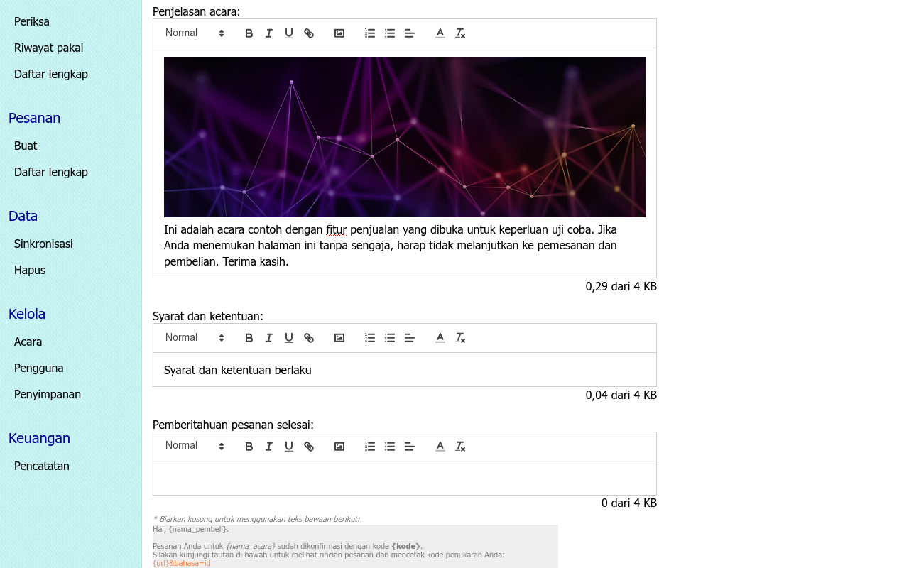

---

## 10 Mei 2025

|           | Sistem  | Situs web |
| --------- |:-------:|:---------:|
| **Versi** |`b0101c7`|`81f1716`  |

### Perubahan

**Peningkatan fitur:**
1. Opsi "Tampilkan persentase saja" kini juga di laporan pintu (sebelumnya hanya ada di laporan penukaran).

**Perbaikan bug:**
1. Terjemahan bahasa Inggris yang hilang untuk opsi "Tampilkan persentase saja".
2. Link "Tampilkan persentase saja" yang tidak hilang saat cetak dan salin sebagai gambar.

_Tidak ada halaman baru di rilis ini._

---

## 5 Mei 2025

|           | Sistem  | Situs web |
| --------- |:-------:|:---------:|
| **Versi** |`291eb67`|`81f1716`  |

### Perubahan

**Peningkatan fitur:**
1. Di laporan penukaran grafik, kini ada "Tampilkan persentase saja". Bisa ditoggle, jadi kalau mau lihat angkanya lagi, tidak perlu refresh halaman.

_Tidak ada halaman baru dan perbaikan bug di rilis ini._

### Tangkapan layar

- _Peningkatan fitur #1 - Lokasi tombol_
  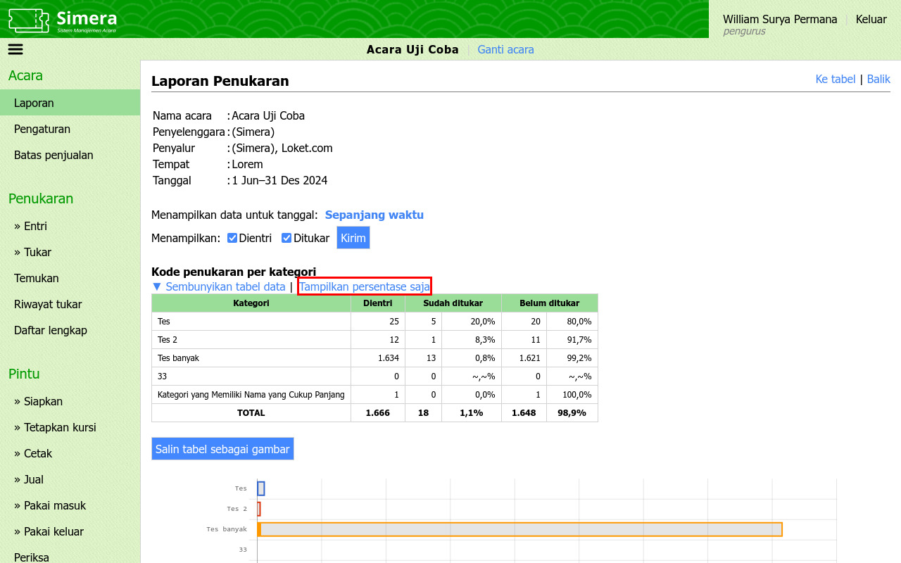
- _Peningkatan fitur #1 - Tampilan tabel setelah diklik_
  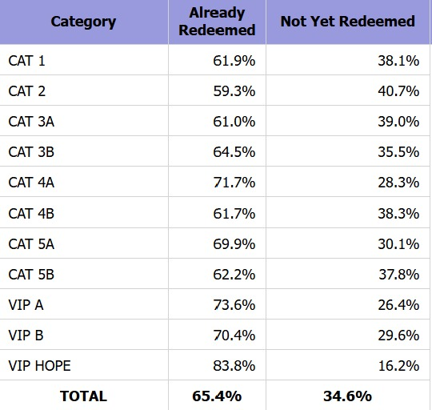

---

## Yang lebih lama

- **Sebelum Agustus 2024:**
  catatan rilis maupun log perubahan sudah tidak tersedia.
- **Agustus 2024 - Januari 2025:**
  catatan rilis sudah tidak tersedia, namun log perubahan* tersedia di Github.
- **Februari 2025 - April 2025:**
  catatan rilis tersedia di grup "System Update".

*Satu rilis dapat memuat beberapa log perubahan, dan kemungkinan besar diterbitkan di tanggal yang berbeda dari perubahan kode terakhir.

---

## Informasi lebih lanjut

Silakan buka diskusi di grup "System Update", atau hubungi William Surya Permana.

---

_Akhir dari dokumen_ &#x7C; [Kembali ke atas](#)